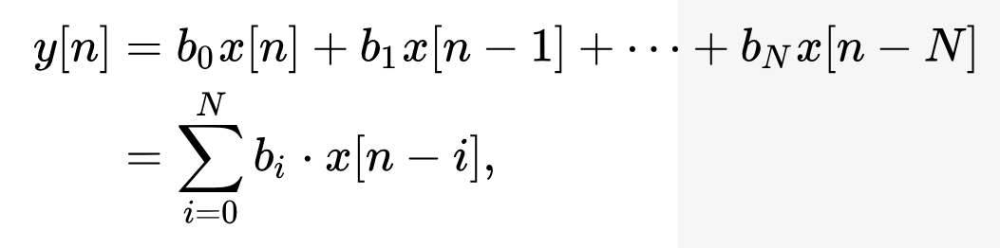
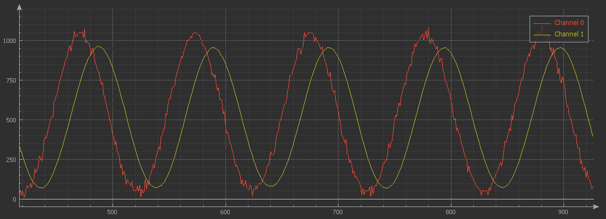
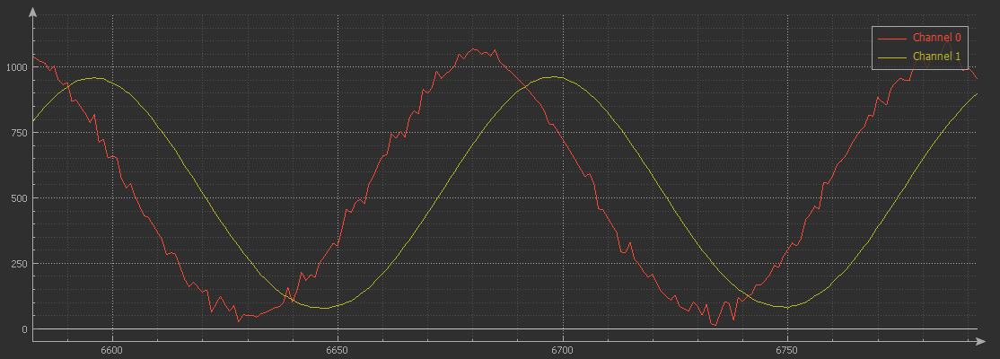
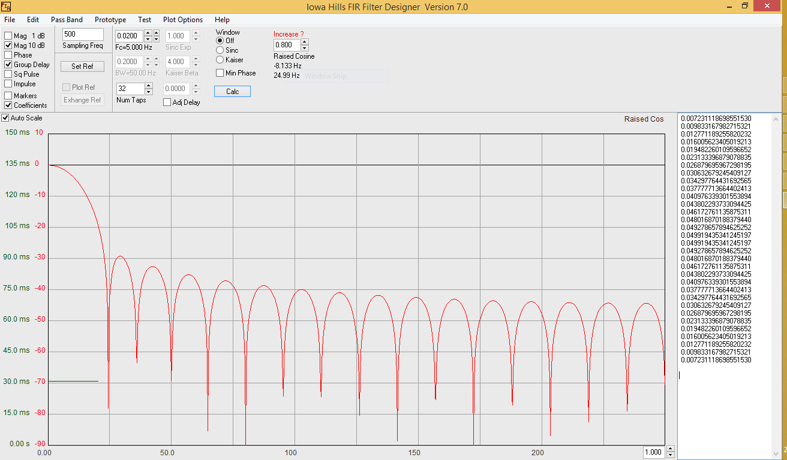
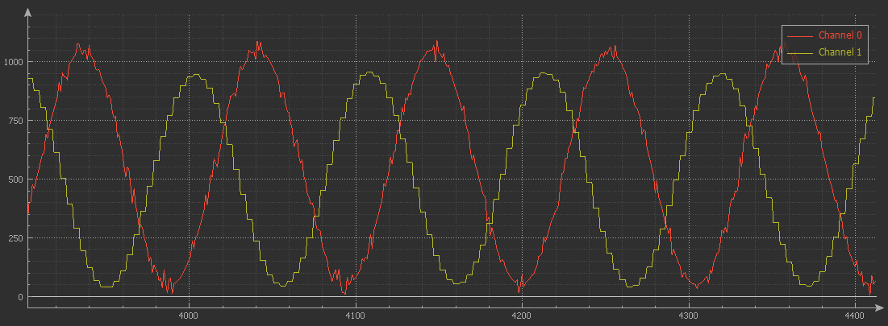
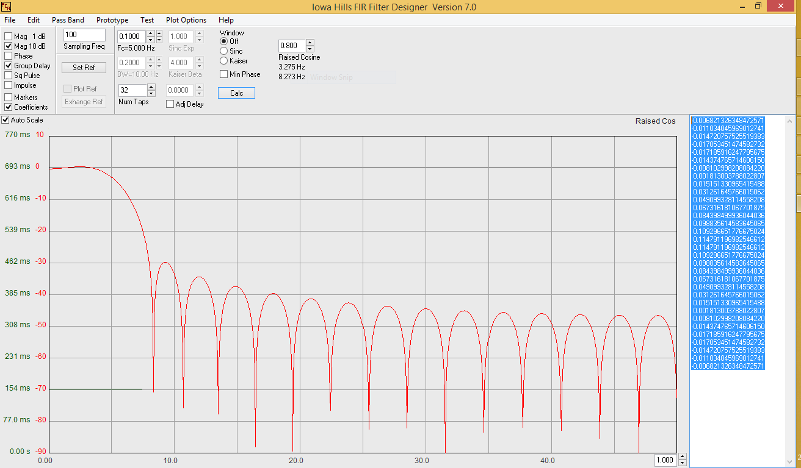
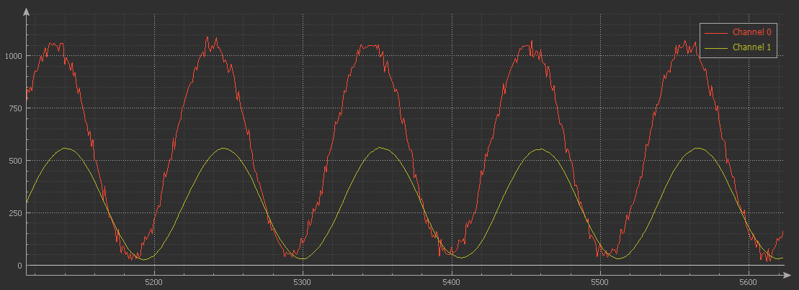
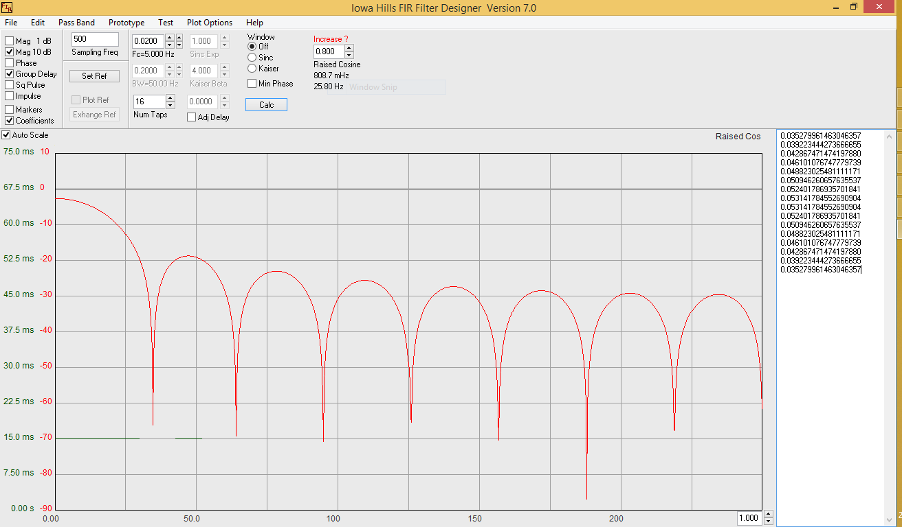
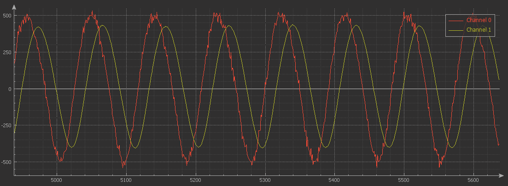

# FIR Filter

finite impulse response (FIR) digital filter for microcontroller

# Concept block 





# Code usage

```
/* Include library */
#include "fir.h"

/* Filter objects */
movingAverage_t fir_ftr;
movingAverage_t fir_ftr_2;

/* co-eff value calculated from Iowa Hills FIR Filters tool */

float low_pass_coeff[] = {

 0.033037850144342927,
 0.115593443353483427,
 0.195352709288829529,
 0.244281564490212016,
 0.244281564490212016,
 0.195352709288829529,
 0.115593443353483427,
 0.033037850144342927

};


float high_pass_coeff[] = {

 0.020062112266054671,
 0.039940619065501934,
 0.053593365042411495,
 0.053416852363487331,
 0.031286041832566183,
-0.023735038477653174,
-0.142727313632826841,
-0.612151054466002487,
 0.612151054466002487,
 0.142727313632826841,
 0.023735038477653174,
-0.031286041832566183,
-0.053416852363487331,
-0.053593365042411495,
-0.039940619065501934,
-0.020062112266054671

};

void main()
{
   /* Initialization of filters */
   fir_create(&fir_ftr, low_pass_coeff, 8, 1.176, 100);    /* filter size 8, sample time 100ms */
   fir_create(&fir_ftr_2, high_pass_coeff, 16, 1, 150);    /* filter size 16, sample time 150ms */

   while(1)
   {
      signal = signal_source();  /* signal source function may ADC, Capture count, sensor data*/

      /* Filter process
      * 
      * call this function maximum passible short time
      */
      fir_filter(&fir_ftr, signal);
      fir_filter(&fir_ftr_2, signal);

      process_or_print = fir_ftr.filtered;
      process_or_print = fir_ftr_2.filtered;
   }
}

```

# Filter images

   + channel 0 - signal + noise (+/- 50)
   + channel 1 - filter output

## 32 Tab filter 500Hz

   + Sampling frequency - 500hz
   + cutoff frequency - 5hz



Zoom 



Iowa Hills FIR Filters tool configuration



## 32 Tab filter 100Hz

   + Sampling frequency - 100hz
   + cutoff frequency - 5hz



Iowa Hills FIR Filters tool configuration




## 16 Tab filter 500Hz

   + Sampling frequency - 500hz
   + cutoff frequency - 5hz



Iowa Hills FIR Filters tool configuration



## Signed values



Thanks to [Iowa Hills FIR Filters tool](http://iowahills.com/5FIRFiltersPage.html) 
[Download](http://iowahills.com/Downloads/Iowa%20Hills%20FIR%20Filters.zip)

# Refer other filters

   + [Moving Average](https://github.com/binarymaker/moving-average-filter)
   + [Moving Median](https://github.com/binarymaker/moving-median-filter)